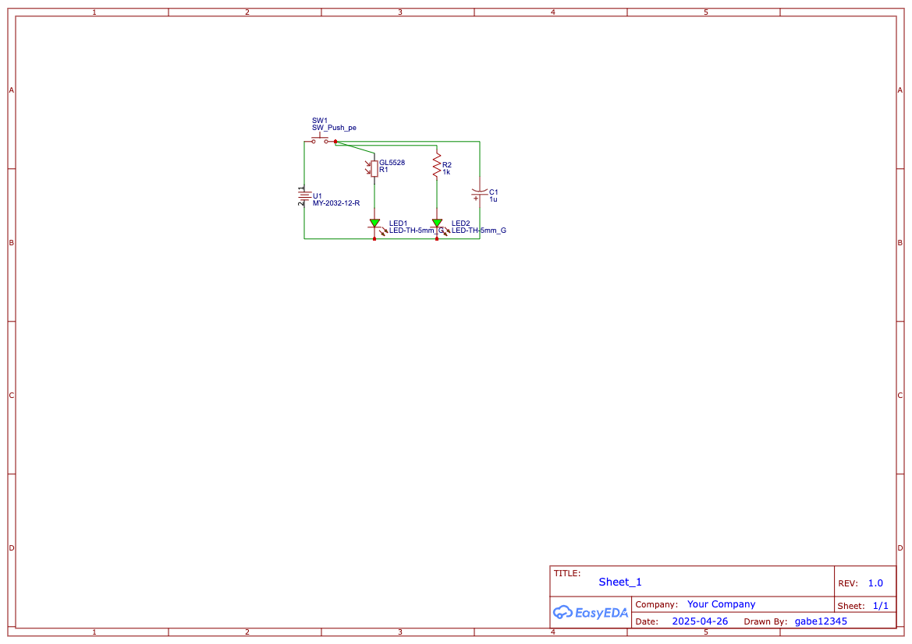

# solder-project
Project for HackClub's Solder YSWS. My first real PCB!!!!!!!!!! 
I used one battery holder, one capacitor, one resistor, one photoresistor, one button, and two LEDs.  
Slack username is Gabriel Whigham

.png)
